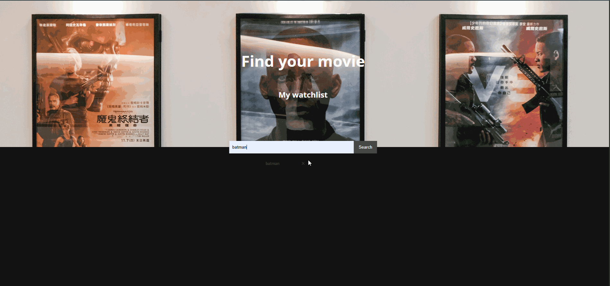

# Movie Watchlist

A movie search app that lets you build a personal watchlist. Search any title via the OMDb API, browse results with posters, ratings, runtime, and synopsis, and save the ones you want to watch later.



## Why I built it

I wanted to practice working with a real third-party API and managing client-side state without reaching for a framework. No React, no build tools — just HTML, CSS, and vanilla JavaScript talking directly to the browser DOM. The constraint was the point.

## Features

- Search any film by title (results pull live from the OMDb API)
- View poster, IMDb rating, runtime, genre, and plot summary for each result
- Add or remove films from a personal watchlist with one click
- Watchlist persists across page reloads via `localStorage`
- Separate page renders the saved watchlist with quick-remove buttons
- Search works with both button click and Enter key

## Tech stack

- **Vanilla JavaScript** (no framework)
- **Fetch API** for HTTP requests
- **OMDb API** as the data source
- **localStorage** for client-side persistence
- **HTML / CSS** for layout and styling

## Running locally

```bash
git clone https://github.com/Clevert3ch/MovieWatchlist-API.git
cd MovieWatchlist-API
```

Get a free API key from [OMDb](http://www.omdbapi.com/apikey.aspx), then open `index.js` and replace the `apiKey` value with your own.

Open `index.html` in a browser. No build step required.

## Notes on security

This project predates my understanding of how to keep API keys off the client. The OMDb key is currently hardcoded in the source — fine in a prototype, not acceptable for production. The free OMDb tier mitigates the risk (rate-limited, no payment info), but the right fix is to proxy the request through a serverless function so the key never reaches the browser.

I plan to revisit this with the same backend pattern I'm building for my Chef Claude project.

## What I learned

- How to structure an app around async API calls without a framework — keeping the DOM and the data in sync manually is genuinely harder than letting React do it.
- That `localStorage` is synchronous and stores strings only, so anything structured needs to be `JSON.stringify`'d going in and `JSON.parse`'d coming out.
- The difference between a search endpoint and a details endpoint in REST APIs (OMDb's search returns minimal data; you need a second call per result for ratings and plot).
- Why hardcoded API keys are a problem and what the right architectural fix looks like.
